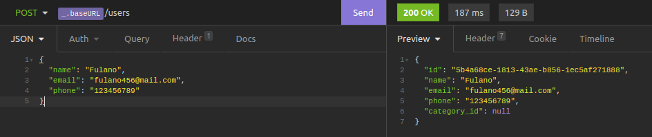
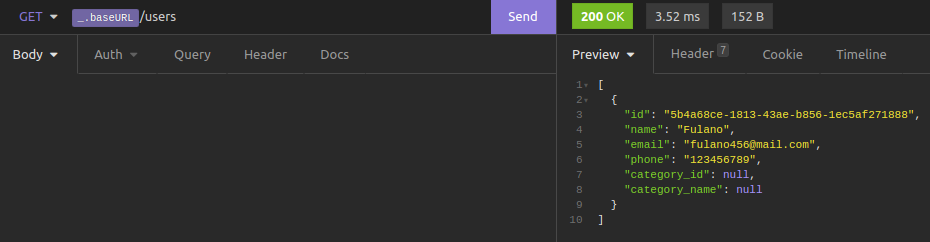
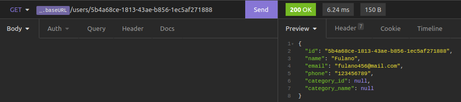
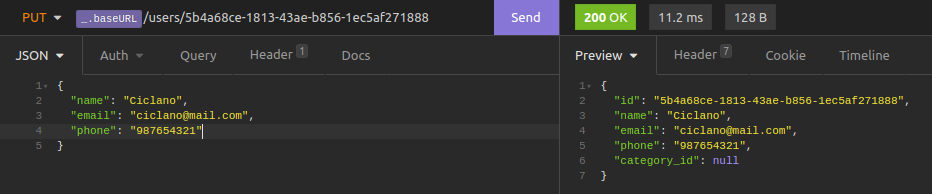
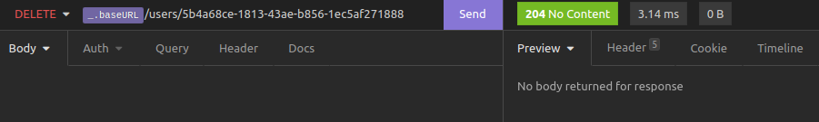
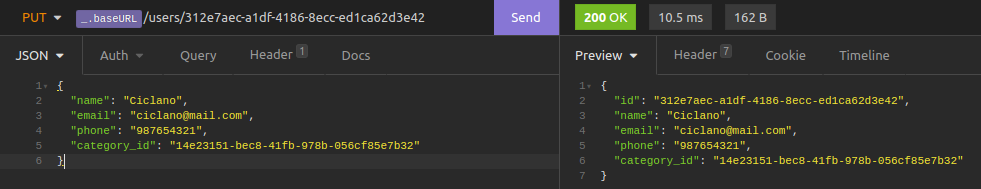
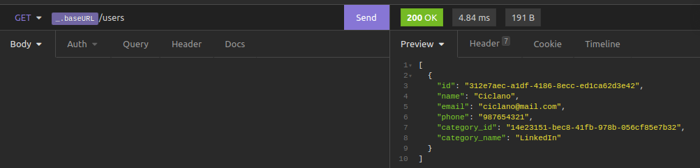

<h1 align="center">
  
</h1>
<p align="center">Esse projeto é uma API REST de um CRUD (create, read, update & delete) de usuários e categorias para a vaga de estágio como programador full stack na Kiral</p>

<p align="center">
  <a href="#preRequisitos">Pré-Requisitos</a> •
  <a href="#instalacao">Instalação</a> •
  <a href="#configuracao">Configuração</a> •
  <a href="#comoUsar">Como usar</a> •
  <a href="#tecnologias">Tecnologias</a>
</p>

<h4 align="center">
  🔥 Projeto finalizado 🔥
</h4>

<h2>Features</h2>

- [x] Criação de usuário
- [x] Listagem de usuários
- [x] Listagem de usuário
- [x] Alteração de dados do usuário
- [x] Deleção de usuário

- [x] Criação de categoria
- [x] Listagem de categorias
- [x] Listagem de categoria
- [x] Alteração de dados da categoria
- [x] Deleção de categoria

<h2 id="preRequisitos">Pré-requisitos</h2>

<p>
  Antes de começar, você vai precisar ter instalado em sua máquina as seguintes ferramentas:
  
  [Git](https://git-scm.com), [Node.js](https://nodejs.org/en/), [Insomnia](https://insomnia.rest/download) & [Docker](https://www.docker.com/get-started)

  Além disto é bom ter um editor para trabalhar com o código, como o [VSCode](https://code.visualstudio.com/)
</p>

<h2 id="instalacao">Instalando o Docker</h2>

<p>
  Entre no site https://www.docker.com/get-started e baixe o Docker Desktop, se o seu sistema operacional for Windows, baixe o executável, next em todos os passos do instalador e provavelmente irá pedir para reiniciar o PC.
  <br>
  
  Caso for linux, selecione View Linus Engine e será redirecionado para outra página que você irá selecionar sua distro. Vocẽ será redirecionado novamente para outra página e lá irá clicar no último link da mesma, te levando para uma página com todas as instruções para instalar o docker, via terminal.
  <br>

  Rode um docker -v no terminal e se mostrar a versão, é porque está pronto para uso.
</p>

<h3>Observação ⚠️</h3>
<p>
  Os comandos abaixo possuem a palavra "sudo" no começo, essa palavra é responsável por dar a permissão de root (administrador) para a instalação, pois a distro do Ubuntu que estou utilizando, só instala com permissão. Se o seu SO não precisa, então ignore a palavra em todos os comandos abaixo no terminal.
</p>

<h2 id="configuracao">Rodando e configurando o banco de dados no Docker</h2>

```bash
# Clone este repositório para baixar o projeto
$ git clone https://github.com/rafaelmyb/apiChallenge.git

# Instale as dependências
$ yarn install
  # ou
$ npm install

# Baixe a imagem do postgres, que é o banco de dados utilizado no projeto
$ sudo docker pull postegres

# Crie um container no docker com o postgres como banco
$ sudo docker run --name postgresApiChallenge -e POSTGRES_USER=root -e POSTGRES_PASSWORD=root -p 5432:5432 -d postgres

# No terminal do projeto, starte o container
$ sudo docker exec -it postgresApiChallenge bash

# Entre no docker
$ psql -U root

# Crie o banco de dados (se não criar na primeira vez, copie o mesmo código no schema.sql e cole no terminal, aparecerá CREATE DATABASE logo abaixo do código colado)
$ CREATE DATABASE apichallenge;

# Conecte no banco que criou
$ \c apichallenge

# Copie e cole o código do schema.sql a partir de CREATE EXTENSION

# Após criado o banco, podemos abrir um novo terminal no vscode e rodar o projeto
$ node src/index.js

# Vale lembrar que o servidor do projeto, deve estar rodando na porta 3000.
```

<h2 id="comoUsar>Testando o projeto</h2>
<p>
  Na pasta github do projeto, encontrará um arquivo com o nome "Insomnia_2021-09-22.json", esse arquivo contém todas as rotas para testar o crud, basta importa-lo dentro do Insomnia. Para isso, com o mesmo aberto, clique no botão Create e clique na opção + File, na caluna Import From. Busque pela pasta do projeto e importe o arquivo citado.

  Dentro do Insomnia, crie primeiramente um novo user, basta no body do método POST, colocarmos as propriedades para esse user. Fique à vontade para criar mais usuários.

  
  <br>
  
  Para listar os users, basta enviar a requisição:

  
  <br>

  Para listar um usuário específico, pegue o id dele e coloque na url do Get User:

  
  <br>

  Para alterar os dados de algum usuário em específico, pegue o id dele e coloque na url do Update User e faça as alterações desejadas no body:

  
  <br>

  Para deletar algum usuário, pegue o id dele e coloque na url do Delete User. Se o status code for 204 No content, o usuário foi deletado com sucesso.
  
  
  <br>

  Os mesmo métodos funcionam com a tabela de categorias. Para relacionar uma categoria com um usuário, basta fazer um update do usuário e colocar o id da categoria no category_id do usuário:

  
  <br>

  Quando listar novamente os usuários, irá ver que o category_name foi adicionado:
  
  <br>
  
  Uma observação é que não podemos na atual etapa da API, excluir uma category que já esteja associada a algum user. Quando tentarmos deleta-la, irá dar um status code 500 internal server error e no terminal do vscode irá acusar no detail do erro, que o id que iamos excluir ainda está referenciado na tabela de users. Então para excluirmos essa category, nós alteramos o usuário e tiramos o category_id dele.
</p>

<hr>
<br>
<p>
  API REST de um CRUD de usuários criado. O desafio pedia apenas um CRUD de usuários, mas optei por colocar mais um CRUD de categorias para demonstrar a relação de chave estrangeira no banco de dados.  
</p>

<hr>
<br>

<h3 id="tecnologias">🛠 Tecnologias</h3>

As seguintes ferramentas foram utilizadas na construção do projeto:

- [Node.js](https://nodejs.org/en/)
- [Postgres](https://www.postgresql.org/)
